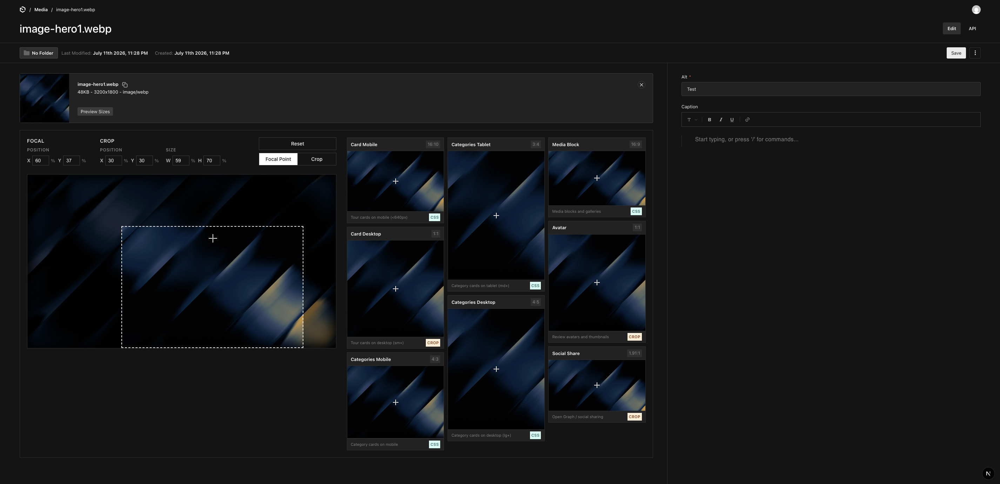

# payload-plugin-aspect-preview

Single-screen crop, focal point, and **live multi-aspect-ratio preview** for Payload upload collections. Replaces Payload's separate crop/focal drawers with one editor that shows, in real time, how your image will look at every aspect ratio your frontend uses.



## Features

- Crop, focal point, and preview on **one screen** — no drawer round-trips.
- **Live preview grid** across any set of aspect ratios as you drag the focal point or draw a crop.
- **Zero-config defaults** (six common ratios) — override with your own list.
- Simulates the frontend's `object-fit: cover` + focal positioning so previews match production.

## Requirements

- Payload `^3.85.0`
- React `^19`

> **Compatibility note:** the replacement upload field builds on `@payloadcms/ui` internals (`FileDetails`, `Dropzone`, `PreviewSizes`, …). These are not a stable public API, so a Payload minor upgrade may occasionally require a plugin update. Pin your Payload version and test after upgrades.

## Installation

```bash
pnpm add payload-plugin-aspect-preview
```

## Quick start

```ts
import { aspectPreviewPlugin } from 'payload-plugin-aspect-preview'

export default buildConfig({
  // ...
  plugins: [
    aspectPreviewPlugin({ collections: ['media'] }), // uses built-in default ratios
  ],
})
```

Your `media` collection must be an upload collection (`upload: { ... }`), ideally with `focalPoint: true`.

## Configuration

| Option | Type | Required | Default | Description |
|---|---|---|---|---|
| `collections` | `string[]` | yes | — | Upload collection slugs to enhance. |
| `aspectRatios` | `AspectRatioConfig[]` | no | `DEFAULT_ASPECT_RATIOS` | Ratios shown in the preview grid. |
| `disabled` | `boolean` | no | `false` | Keep the schema field but disable the upload override. |

### `AspectRatioConfig`

| Field | Type | Required | Description |
|---|---|---|---|
| `name` | `string` | yes | Display label (e.g. `"Social Share"`). |
| `ratio` | `string` | yes | Display token (e.g. `"16:9"`). |
| `width` | `number` | yes | Ratio numerator (or absolute px width). |
| `height` | `number` | yes | Ratio denominator (or absolute px height). |
| `source` | `'css' \| 'crop'` | no | Badge showing how the frontend renders it. Default `'css'`. |
| `usage` | `string` | no | Description shown in the card footer. |
| `category` | `string` | no | Free-form grouping label. |

## Examples

**Custom aspect ratios**

```ts
aspectPreviewPlugin({
  collections: ['media'],
  aspectRatios: [
    { name: 'Hero', ratio: '21:9', width: 21, height: 9, source: 'css', usage: 'Landing hero' },
    { name: 'Card', ratio: '1:1', width: 1, height: 1, source: 'crop', usage: 'Product cards' },
  ],
})
```

**Multiple collections**

```ts
aspectPreviewPlugin({ collections: ['media', 'avatars'] })
```

**Disable without dropping the schema**

```ts
aspectPreviewPlugin({ collections: ['media'], disabled: true })
```

## How it works

The plugin wraps each upload collection with a custom admin UI component (`CustomUpload`). It injects a UI field (`FocalPointEditor`) that overlays the live preview grid, replacing Payload's default crop/adjust drawer. The grid simulates `object-fit: cover` with the focal point as the anchor, so you see exactly how each ratio will render on the frontend. Crop and focal coordinates are stored in the document's built-in `focalPoint` field (if present) and in-memory image crop state managed by react-image-crop.

## License

MIT © Sebastian Kolbusz
